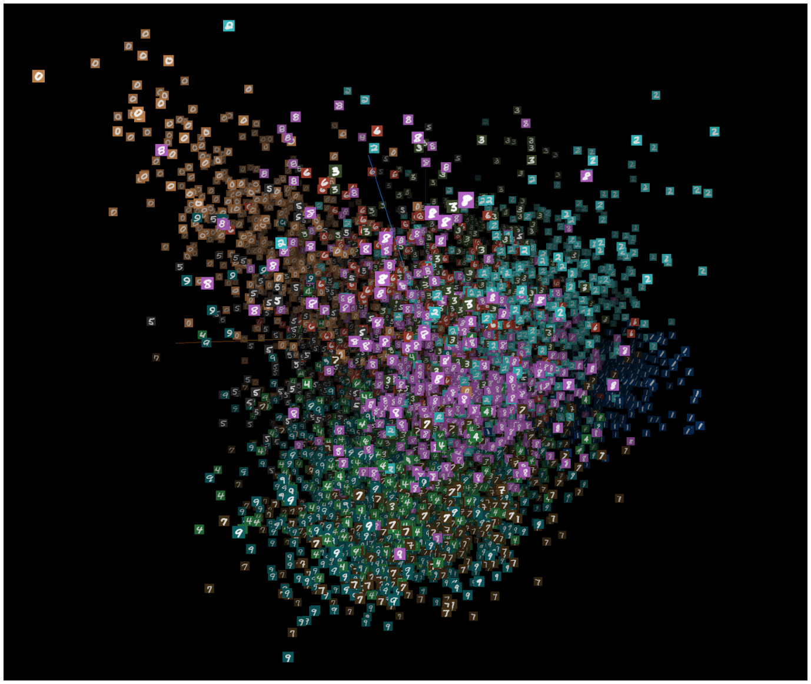
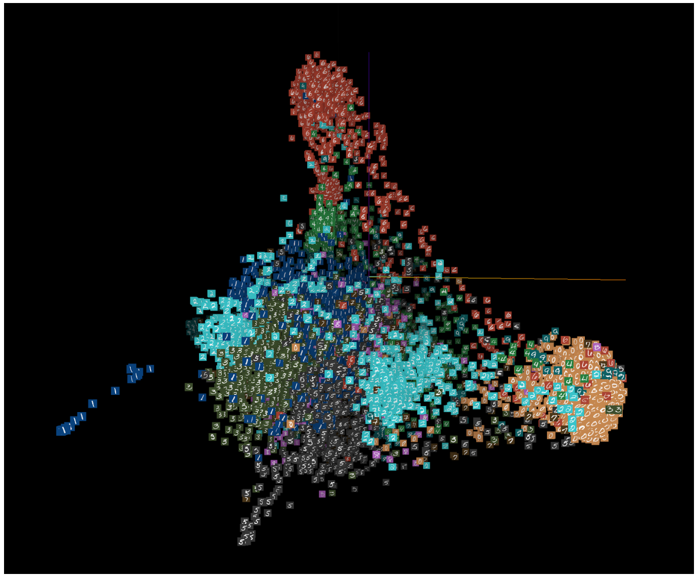
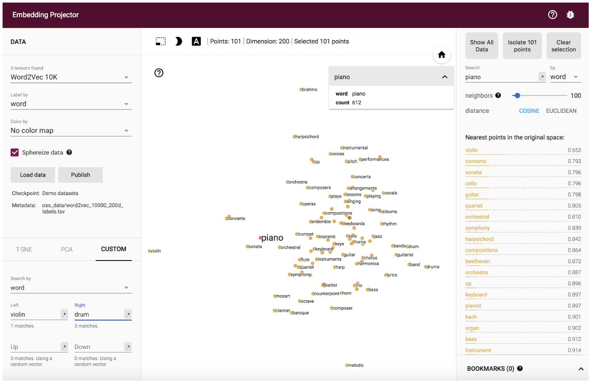

# Assignment 6: Embeddings and Generative Models
Adapted by Mark Sherman <shermanm@emmanuel.edu> from MIT 6.S198 under Creative Commons
Emmanuel College - IDDS 2132 Practical Machine Learning

This assignment is based on work by Yaakov Helman, Natalie Lao, and Hal Abelson

# Visualizing datasets using the embedding projector

Read the short introduction in [BACKGROUND.md](BACKGROUND.md#visualizing-datasets-using-the-embedding-projector)

Open your browser to the Embedding Projector at <http://projector.tensorflow.org/>. **Pick the data set to be "MNIST with images", color by "label", make sure that "spherize data" is NOT checked.** 

Towards the bottom left of the screen, pick **PCA** as the embedding method.

At the top center of the screen, click on the moon image to the show the digits images as white on black ("night mode").

You should see a cloud of the 10,000 images in the MNIST collection, mapped into a 784-dimensional space: each MNIST image is 24⨉24 = 784 pixels, and each pixel has an intensity running between 0 (white) and 1 (black). Each image can thus be represented by 784 values between 0 and 1, i.e., as a point in 784-dimensional space. 

Your screen is showing the collection of MNIST points projected down into 3 dimensions. Each point is colored according to its label (one of the digits 0 through 9). You can use the mouse to move and rotate the 3-dimensional clump.



## How this Visualization Works

Read about PCA vs t-SNE in [BACKGROUND.md](BACKGROUND.md#how-this-visualization-works)

## Problem 1

Change the projection method from **PCA** to **t-SNE**. Give the computation a minute to initialize and another minute or two for the shape to stabilize. Bear in mind that even though the 3-dimensional shape is changing, this is still the same set of points in 784-dim space at each step. Only the projection is changing. This is how it might look after a few hundred iterations:




Spend some time using the embedding projector to make and share observations about the MNIST data. Do the different digits separate into distinct clouds? Are there images that are in the wrong cloud, and can you make sense of why they are wrong? Are there images that are outliers from the rest of the data? Are there digits that seem more separate from the others, and are there pairs of digits that are more easily confused? Take notes on these and other observations that you make and write them up for your assignment.

> Insert your response here.

# Words as vectors

Run through the learning activity in [BACKGROUND.md](BACKGROUND.md#words-as-vectors)

# 1.3: Word geometry

Embedding words in a geometric space lets us examine distances between words. The intuition with Word2Vec is that nearby words tend to appear in the same phrases. But we can think about more than just distance. For example, given a word A and a word B, we can examine how the nearby words change as we move along the line from A to B.

## Problem 2

Pick a word to explore with the embedding projector, say, "piano". Type that word in the search bar and click "Isolate 101 points". Now at the bottom left, change the embedding method from PCA to CUSTOM. Fill in "violin" on the left and "drum" on the right. The words will now be displayed from left to right according to their distance along the line from "violin" to "drum". (You'll notice that you're now unable to rotate the 3D space due to the left/right settings.) Can you give any interpretations to what is shown? 



Remember that this geometry is not based on any word definitions, but rather only the frequencies with which words co-occur in phrases. Also keep in mind that the vertical positions of the words are random, although you can specify these, too, by setting "up" and "down". 

Experiment with various words to see if you can identify any insights about the data set. 

For example, try "politics" along the dimension from "bad" to "good", or "engineer" along the spectrum from "man" to "woman". 

Write up some notes on your observations, perhaps supplemented with a few pictures. 

* Do you get different or better results if you use Word2Vec All instead of 10K? 
* Did you find any interesting examples that speak to how words are used news articles? 
* Write up what you experimented with and what conclusions you drew.

> Write your results here.

# Finding word analogies with vector algebra

One amusing use of word embeddings is to use vector arithmetic to generate analogies. 

Consider the analogy:

```
man is to woman as king is to ?
```

One way to solve this is to view the words as vectors in embedding space, compute the offset from "man" to "woman", apply that same offset to "king" and find the closest word to the result. Or, expressed in vector arithmetic

```
? ≈ king + (woman - man)
```

## Problem 3

# Exploring fonts with the Embedding Projector

Take a look at a different embedding space this one for fonts, by navigating to the page [goo.gl/F3tjgs](http://projector.tensorflow.org/?config=https://raw.githubusercontent.com/ec-idds/font-embeddings-config/master/config.json).

This page contains the Embedding Projector loaded with a dataset of 8,192 fonts. Each font is identified by a numerical font ID and is represented by a 40-dimensional vector. In the projector, each font is depicted by the "capital A" of that font. (Note: The character might be more visible if you display in "night mode" by clicking on the moon at the top of the screen.) 


Do the following activities:

1\. View the fonts with PCA embedding. Do you see any clumps/areas with obvious characteristics? Record a few Font IDs for distinct characteristics/groupings that you find interesting (hover over a character to get its font ID), such as bold, italics, cursive...etc.

> Response here

2\. Change to the embedding to T-SNE. Record how many iterations you let T-SNE run for and whether you were able to get interesting groupings. Again, record Font IDs for interesting fonts/groupings.

> Response here

3\. Find a font you like, get its ID, and type that into the search bar at the right-hand side of the screen. Use the "neighbors" slider to isolate a few dozen points and record the Font IDs of the 10 nearest neighbors that make sense. Repeat this for 3 or 4 fonts. If you find a font that doesn't have nearest neighbors that look similar, note that down as well.

> Response here


This work is licensed under a [Creative Commons Attribution 4.0 International License](http://creativecommons.org/licenses/by/4.0/).